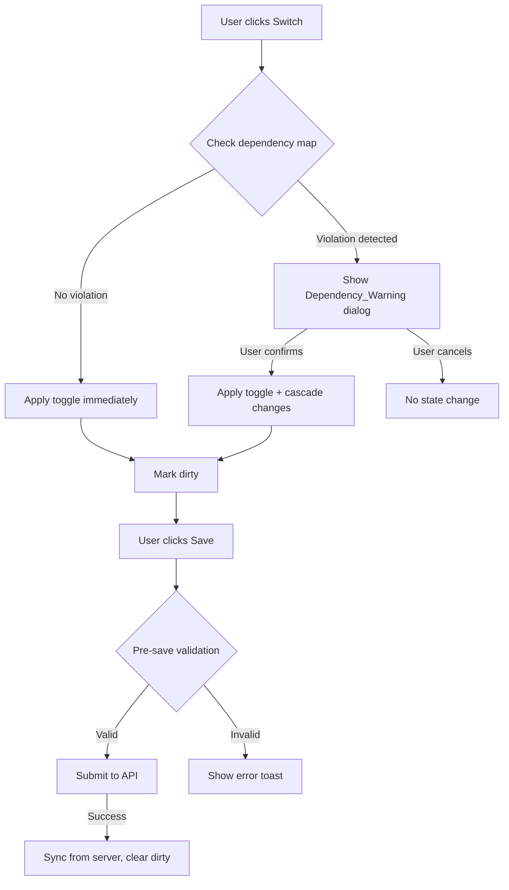

# Design Document: Feature Dependency Warnings

## Overview

This feature adds dependency-awareness to the Features settings page (`/dashboard/settings/features`). When a tenant admin toggles a feature on or off, the system checks whether the action would violate a declared dependency between features. If it would, a confirmation dialog is shown before any change is applied. The implementation is entirely frontend — no backend changes are required, since the dependency rules are static and the save API already accepts an arbitrary set of enabled features.

The existing page already manages a local `enabled: Set<FeatureKey>` state and calls `updateFeatures.mutate([...enabled])` on save. This design layers dependency checking on top of the existing `toggle` function and adds a pre-save validation step.

## Architecture

The feature is implemented as a pure frontend enhancement to the existing `FeaturesPage` component. The key additions are:

1. A static **dependency map** declared as a constant.
2. A **dependency resolution utility** that computes what side-effects a toggle would produce.
3. A **confirmation dialog** (using the existing shadcn/ui `AlertDialog`) shown when a violation is detected.
4. A **pre-save guard** that validates the final enabled set before submitting.



## Components and Interfaces

### Dependency Map

A static record declared in the features page (or a co-located constants file):

```ts
// Maps each feature to the features it REQUIRES (its dependencies)
const FEATURE_DEPENDENCIES: Partial<Record<FeatureKey, FeatureKey[]>> = {
  payments: ["events"],
  products: ["categories"],
};
```

This map is the single source of truth. Adding a new dependency here automatically enforces it without touching warning logic.

### Dependency Resolution Utility

A pure function that takes the current enabled set, the feature being toggled, and the direction, and returns what changes need to happen:

```ts
interface DependencyCheckResult {
  requiresWarning: boolean;
  // Features that will be automatically disabled alongside the toggled feature
  willAlsoDisable: FeatureKey[];
  // Features that will be automatically enabled alongside the toggled feature
  willAlsoEnable: FeatureKey[];
}

function checkDependencies(
  enabled: Set<FeatureKey>,
  feature: FeatureKey,
  nextState: boolean // true = enabling, false = disabling
): DependencyCheckResult
```

**Disabling logic**: Find all features in `enabled` that list `feature` as a required dependency. Those are `willAlsoDisable`.

**Enabling logic**: Find all required features of `feature` that are not currently in `enabled`. Those are `willAlsoEnable`.

### Pending Toggle State

When a violation is detected, the toggle is not applied immediately. Instead, the pending action is stored in component state:

```ts
interface PendingToggle {
  feature: FeatureKey;
  nextState: boolean;
  willAlsoDisable: FeatureKey[];
  willAlsoEnable: FeatureKey[];
}

const [pendingToggle, setPendingToggle] = useState<PendingToggle | null>(null);
```

The dialog is shown when `pendingToggle !== null`.

### DependencyWarningDialog Component

A new component wrapping shadcn/ui `AlertDialog`:

```tsx
interface DependencyWarningDialogProps {
  open: boolean;
  pending: PendingToggle | null;
  featureMeta: Record<FeatureKey, { label: string }>;
  onConfirm: () => void;
  onCancel: () => void;
}
```

The dialog renders:
- A title: "Confirm Feature Change"
- A description built from `pending` data using plain language (e.g., "Disabling Events will also disable Payments because Payments requires Events.")
- An "Apply Changes" confirm button and a "Cancel" button.

### Updated `toggle` Function

```ts
const toggle = (feature: FeatureKey) => {
  const nextState = !enabled.has(feature);
  const result = checkDependencies(enabled, feature, nextState);

  if (result.requiresWarning) {
    setPendingToggle({ feature, nextState, ...result });
  } else {
    applyToggle(feature, nextState, [], []);
  }
};
```

### `applyToggle` Function

Applies the toggle and any cascaded changes to the `enabled` set:

```ts
const applyToggle = (
  feature: FeatureKey,
  nextState: boolean,
  willAlsoDisable: FeatureKey[],
  willAlsoEnable: FeatureKey[]
) => {
  setEnabled((prev) => {
    const next = new Set(prev);
    nextState ? next.add(feature) : next.delete(feature);
    willAlsoDisable.forEach((f) => next.delete(f));
    willAlsoEnable.forEach((f) => next.add(f));
    return next;
  });
  setDirty(true);
};
```

### Pre-Save Validation

Before calling `updateFeatures.mutate`, the `save` function validates the final set:

```ts
function validateFeatureSet(enabled: Set<FeatureKey>): string | null {
  for (const [dependent, required] of Object.entries(FEATURE_DEPENDENCIES)) {
    if (enabled.has(dependent as FeatureKey)) {
      for (const req of required as FeatureKey[]) {
        if (!enabled.has(req)) {
          return `"${FEATURE_META[dependent as FeatureKey].label}" requires "${FEATURE_META[req].label}" to be enabled.`;
        }
      }
    }
  }
  return null;
}
```

If validation fails, a `toast.error(message)` is shown and the save is aborted.

## Data Models

No new data models or API changes are required. The feature operates entirely on the existing `Set<FeatureKey>` local state and the existing `updateFeatures` mutation.

The dependency map is a compile-time constant:

```ts
// Type: Partial<Record<FeatureKey, FeatureKey[]>>
// Key   = dependent feature
// Value = array of features it requires
const FEATURE_DEPENDENCIES = {
  payments: ["events"],
  products: ["categories"],
} as const;
```

Adding a new dependency is a one-line change to this object.

## Correctness Properties

*A property is a characteristic or behavior that should hold true across all valid executions of a system — essentially, a formal statement about what the system should do. Properties serve as the bridge between human-readable specifications and machine-verifiable correctness guarantees.*

### Property 1: Dependency violation always triggers a warning

*For any* enabled feature set and any toggle action — either disabling a feature that has at least one enabled dependent, or enabling a dependent feature whose required feature is currently disabled — `checkDependencies` must return `requiresWarning: true`.

**Validates: Requirements 2.1, 3.1**

---

### Property 2: Confirming a disable cascades to all dependents

*For any* enabled feature set and any feature F being disabled that has enabled dependents, after the user confirms, the resulting enabled set must not contain F and must not contain any feature that lists F as a required dependency.

**Validates: Requirements 2.2, 2.4**

---

### Property 3: Confirming an enable cascades to all required features

*For any* enabled feature set and any dependent feature D being enabled whose required feature R is currently disabled, after the user confirms, the resulting enabled set must contain both D and R.

**Validates: Requirements 3.2, 3.3**

---

### Property 4: Cancel always leaves state unchanged

*For any* enabled feature set and any toggle action (in either direction) that triggers a dependency warning, if the user cancels the dialog, the enabled set must be identical to what it was before the toggle was attempted.

**Validates: Requirements 2.5, 3.4, 4.4**

---

### Property 5: No-violation toggles produce no warning and no cascade

*For any* enabled feature set and any toggle of a feature F where no dependency violation exists (F has no enabled dependents when disabling; F's required features are all already enabled when enabling), `checkDependencies` must return `requiresWarning: false` with empty cascade arrays.

**Validates: Requirements 2.6, 3.5**

---

### Property 6: Saved feature set is always dependency-consistent

*For any* feature set passed to `validateFeatureSet`, if the set contains a dependent feature whose required feature is absent, the function must return a non-null error string. If all dependencies are satisfied, it must return `null`.

**Validates: Requirements 5.2**

---

### Property 7: Dialog message contains all relevant feature names

*For any* pending toggle, the rendered dialog description string must contain the label of the feature being toggled and the labels of all features that will be automatically affected (enabled or disabled as a cascade).

**Validates: Requirements 4.1, 4.2**

---

### Property 8: Dependency map drives all warning logic

*For any* dependency entry in `FEATURE_DEPENDENCIES`, `checkDependencies` must enforce that dependency — producing the correct `requiresWarning` result and cascade arrays — without any changes to the warning logic code.

**Validates: Requirements 1.4**

---

## Error Handling

| Scenario | Handling |
|---|---|
| User toggles a feature with a dependency violation | Show `DependencyWarningDialog`; no state change until confirmed |
| User clicks Save with an inconsistent feature set | `validateFeatureSet` returns an error string; `toast.error` is shown; API call is skipped |
| API save fails | Existing `onError` handler shows `toast.error`; local state is preserved (user can retry) |
| Server returns a different feature set after save | `useEffect` syncs `enabled` from server once `dirty` is reset to `false` |
| `pendingToggle` is set but dialog is closed via overlay click | `onCancel` handler clears `pendingToggle`; no state change |

## Testing Strategy

### Unit Tests

Focus on the pure utility functions and specific examples:

- `checkDependencies`: test all four cases — disable with dependents, disable without dependents, enable with missing required, enable with required already present.
- `validateFeatureSet`: test valid sets, sets with a dependent but missing required, and empty sets.
- `applyToggle` state transitions: verify the `Set` mutations are correct for each combination of cascade arrays.
- Dialog message generation: verify the plain-language string contains the feature names for both disable and enable scenarios (specific examples for `payments`/`events` and `products`/`categories`).
- Specific examples: `payments` depends on `events` (Requirement 1.2), `products` depends on `categories` (Requirement 1.3).

### Property-Based Tests

Use **fast-check** (TypeScript PBT library). Each test runs a minimum of 100 iterations.

**Property 1: Dependency violation always triggers a warning**
Generate random enabled sets and random toggle actions that include a known violation. Assert `checkDependencies` returns `requiresWarning: true`.
`// Feature: feature-dependency-warnings, Property 1: dependency violation always triggers a warning`

**Property 2: Confirming a disable cascades to all dependents**
Generate a random enabled set containing at least one dependent and its required feature. Disable the required feature and confirm. Assert the result set contains neither the disabled feature nor any of its dependents.
`// Feature: feature-dependency-warnings, Property 2: confirming a disable cascades to all dependents`

**Property 3: Confirming an enable cascades to all required features**
Generate a random enabled set missing a required feature. Enable the dependent and confirm. Assert both the dependent and required are in the result set.
`// Feature: feature-dependency-warnings, Property 3: confirming an enable cascades to all required features`

**Property 4: Cancel always leaves state unchanged**
Generate any enabled set and any toggle that triggers a warning. Simulate cancel. Assert the set is deep-equal to the original.
`// Feature: feature-dependency-warnings, Property 4: cancel always leaves state unchanged`

**Property 5: No-violation toggles produce no warning and no cascade**
Generate an enabled set where no violation exists for a given toggle. Assert `checkDependencies` returns `requiresWarning: false` with empty cascade arrays.
`// Feature: feature-dependency-warnings, Property 5: no-violation toggles produce no warning and no cascade`

**Property 6: Saved feature set is always dependency-consistent**
Generate random feature sets. For any set where a dependent is present but its required is absent, assert `validateFeatureSet` returns a non-null error string. For consistent sets, assert it returns `null`.
`// Feature: feature-dependency-warnings, Property 6: saved feature set is always dependency-consistent`

**Property 7: Dialog message contains all relevant feature names**
Generate random pending toggle states. Assert the rendered dialog description contains the label of the toggled feature and all cascade feature labels.
`// Feature: feature-dependency-warnings, Property 7: dialog message contains all relevant feature names`

**Property 8: Dependency map drives all warning logic**
Generate arbitrary dependency maps and feature sets. Assert `checkDependencies` enforces whatever is in the map without code changes.
`// Feature: feature-dependency-warnings, Property 8: dependency map drives all warning logic`
